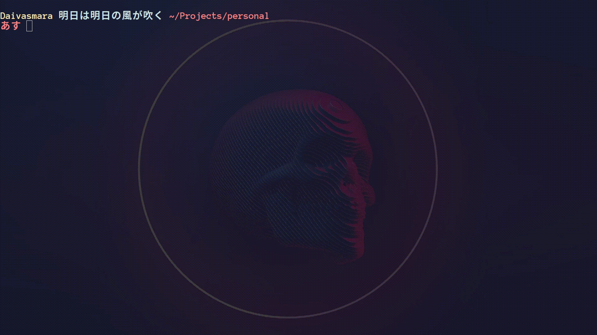

# daivasmara.zsh-theme
> Chill zsh-theme, personal take on smt

**明日は明日の風が吹く**: Tomorrow’s winds will blow tomorrow

**あす**: Tomorrow




```
! ~/.Xresource
*.foreground:   #cbe3e7
*.background:   #1e1c31
*.cursorColor:  #fbfcfc

! black
*.color0:       #565575
*.color8:       #100e23

! red
*.color1:       #ff8080
*.color9:       #ff5458

! green
*.color2:       #95ffa4
*.color10:      #62d196

! yellow
*.color3:       #ffe9aa
*.color11:      #ffb378

! blue
*.color4:       #91ddff
*.color12:      #65b2ff

! magenta
*.color5:       #c991e1
*.color13:      #906cff

! cyan
*.color6:       #aaffe4
*.color14:      #63f2f1

! white
*.color7:       #cbe3e7
*.color15:      #a6b3cc

```
* Font: [Anonymous Pro for Powerline Bold - 14pt](https://github.com/powerline/fonts)

**NOTE:** These are the colors and font that I'm using. You don't necessarily need to set these up, you only need to if you want the looks to be exactly like the gif above.

## Installation

[https://github.com/ohmyzsh/ohmyzsh/wiki/Customization#overriding-and-adding-themes](https://github.com/ohmyzsh/ohmyzsh/wiki/Customization#overriding-and-adding-themes)

## Meta

Daivasmara – [github](https://github.com/daivasmara) – daivasmara@gmail.com

Distributed under the MIT license. See ``LICENSE`` for more information.

[https://github.com/daivasmara/daivasmara.zsh-theme](https://github.com/Daivasmara/daivasmara.zsh-theme)

## Contributing

1. Fork it (<https://github.com/Daivasmara/daivasmara.zsh-theme/fork>)
2. Create your feature branch (`git checkout -b feature/fooBar`)
3. Commit your changes (`git commit -am 'Add some fooBar'`)
4. Push to the branch (`git push origin feature/fooBar`)
5. Create a new Pull Request
